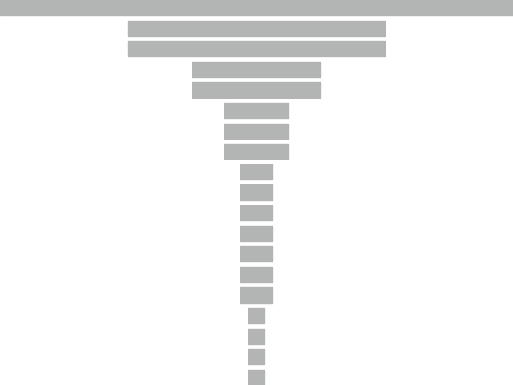

# Shape Adaptor
This repository contains the source code to support the paper: [Shape Adaptor: A Learnable Resizing Module](https://arxiv.org), by [Shikun Liu](shikun.io) and [Adobe Research Team](https://research.adobe.com/). 


## Datasets
This project evaluates on image classification tasks. For small-resolution datasets: CIFAR-10/100, and SVHN, we directly download them based on the official PyTorch data loader. For fine-grained large-resolution datasets: Aircraft, CUB-200 and Stanford Cars, you may download the organised datasets with PyTorch format [in this link](https://www.dropbox.com/sh/m11soye2pj9gvv3/AAAv-aBKOQB65o_1BabkOghaa?dl=0). In AutoTL experiments, we evaluated with the dataset available [in this repo](https://github.com/arunmallya/piggyback). 

*Please note that the datasets (provided in the above links) evaluated in Table 1 (in the original paper) and AutoTL, though might come from the same source, but they are different: All experiments done in Table 1 were based on raw, uncropped images; while in AutoTL, the training images were cropped (to be consistent with prior works).*

## Experiments
You may reproduce most of experiments in the paper by running the following files.

- `utils.py` includes the 
- `model_list.py`  includes the shape adaptor formations and network architectures for VGG, ResNet and MobileNetv2.
- `model_training.py` includes the training and evaluation for shape adaptor networks, vanilla human-defined networks, and AutoSC.
- `model_training_autotl.py` includes the training and evaluation for AutoTL.

For running standard shape adaptor networks, original human-designed networks, or AutoSC (automated shape compression), please run: 

`python model_training.py --FLAG_NAME 'FLAG_VALUE`. 


For running AutoTL (automated transfer learning), please run: 

`python model_training_autotl.py --FLAG_NAME 'FLAG_VALUE'`. 

All flags are well described in each training file, and the default option for each flag represents the one we used in the paper. 

## Shape Visualisation
To visualise shapes, you may modify the file `visualise_shape.py` to generate shapes look like the ones included in the original paper. The following figures present the human-designed shapes for the original VGG-16, ResNet-50 and Mobilenetv2 using our provided code.

VGG-16 | ResNet-50 | MobiletNetv2
------- | --------| ------------
 |   |  

## Other Comments
1. The provided code is highly optimised for readability, with heavy documentations to assist readers to better understand this project. For training with default options and hyper-parameters, you should expect to achieve similar performances (at most +-2\% difference) compared to the numbers presented in the paper. If you have met some weird problems, or simply require some additional help on understanding some parts of the code, please contact me directly, or just post an issue in this repo (preferred, so everybody could see it).

2.  We did not perform any heavy hyper-parameter search on each network and each dataset, i.e. you could possibly achieve a better result by further tuning it. Please check the appendix in the paper for the negative results: this might save you some time, if you are planning to further improve shape adaptors.

3. Training shape adaptor networks with large-resolution datasets are slow (compared to the training time on human-designed networks only, still much faster than NAS methods). This is mainly due to the learned optimal shape requires much more memory than the one from human-designed shape. AutoSC and memory-constrained shape adaptors are the only initial solutions to this problem, but we believe a better shape could be found by breaking the linear relationships between feature weighting and reshaping factors (an important future direction).

4. We have also provided the general formation for shape adaptors in a multi-branch design in Appendix A. Though we did not implement this general version for any experiments, we believe this could be a promising direction towards building an AutoML system to learn neural shape and structure in a unified manner (another important future direction). 


## License
Copyright (C) by Adobe Inc.

Licensed under the CC BY-NC-SA 4.0 (Attribution-NonCommercial-ShareAlike 4.0 International)

The code is released for academic research and non-commercial use only.


## Citation
If you found this code/work to be useful in your own research, please considering citing the following:

```
@inproceedings{shape_adaptor,
  title={Shape Adaptor: A Learning Reshaping Module},
  author={Liu, Shikun and Johns, Edward and Davison, Andrew J},
  booktitle={Proceedings of the European Conference on Computer Vision (ECCV)},
  year={2020}
}
```


## Contact
If you have any questions, please contact `sk.lorenmt@gmail.com`.

